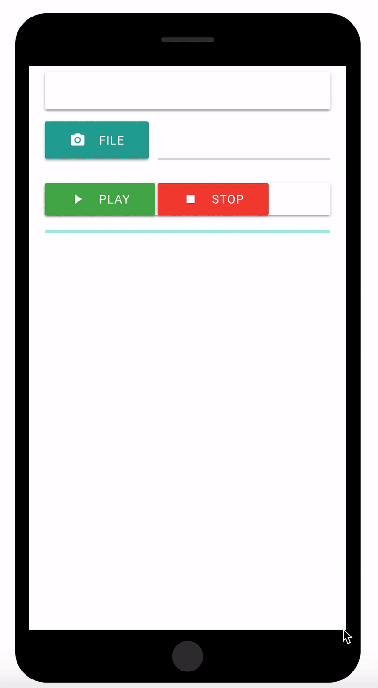

# ocr-app
Accessibility app for the visually impaired

A mobile app from scratch for the visually impaired using Javascript, jQuery, and Materialize that takes in a photo and uses an Optical Character Recognition API to convert images of text into machine-encoded text, and then uses a text-to-speech API to read aloud the text to the user.

Hosted on : https://ocr-site.herokuapp.com/index.html

